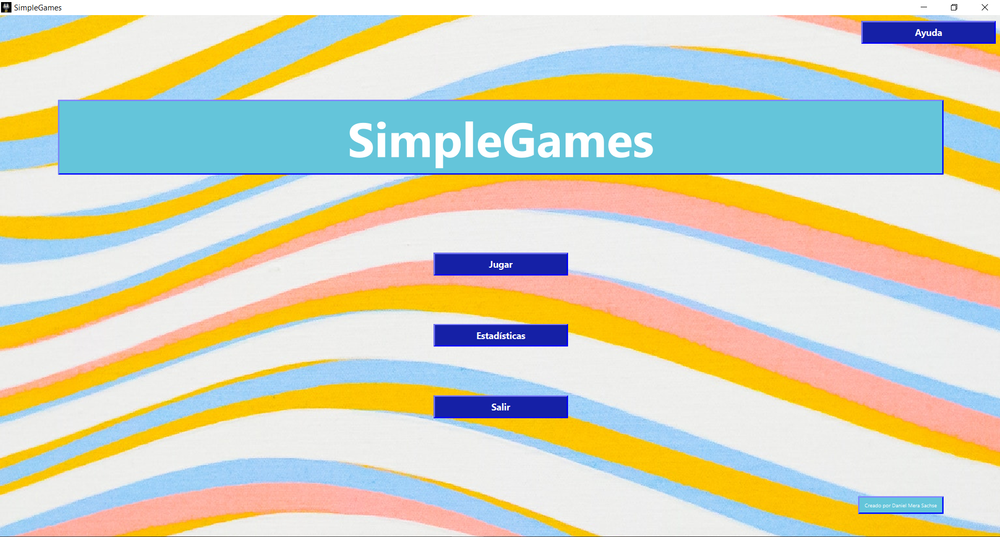
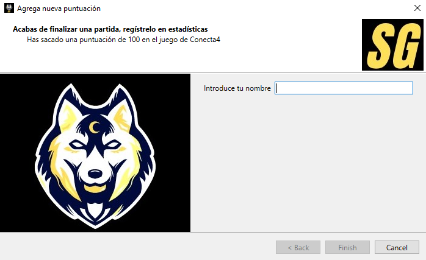
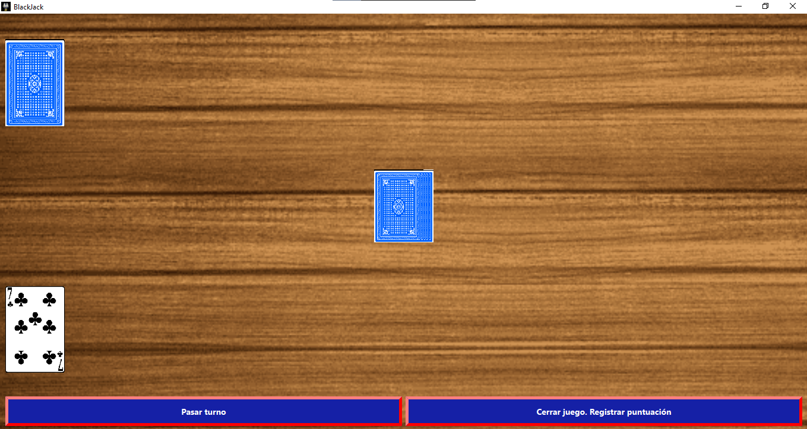
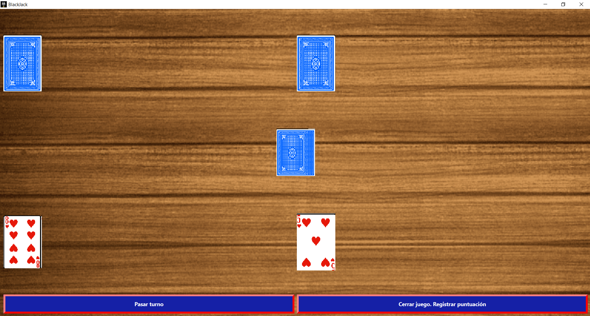
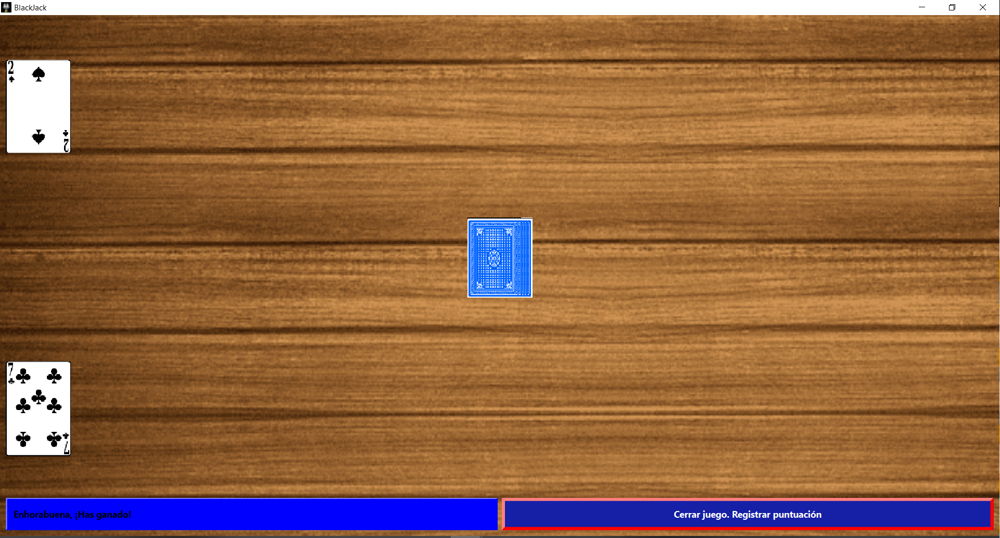
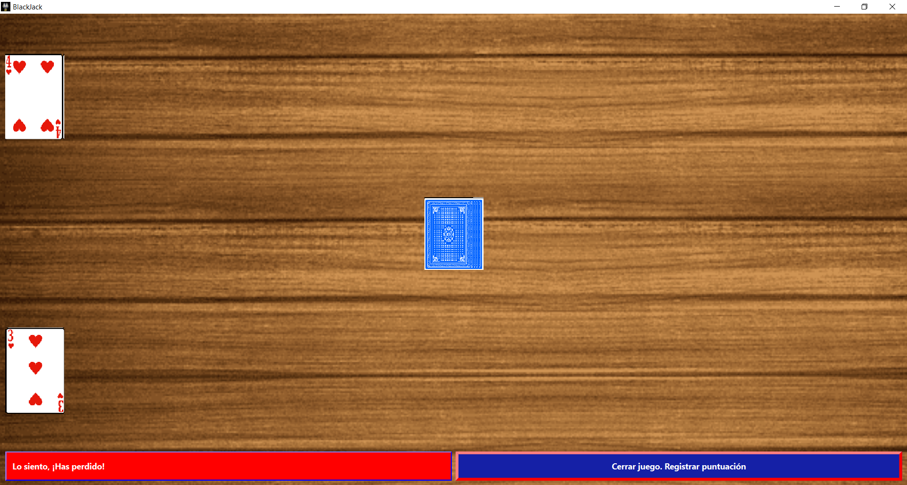
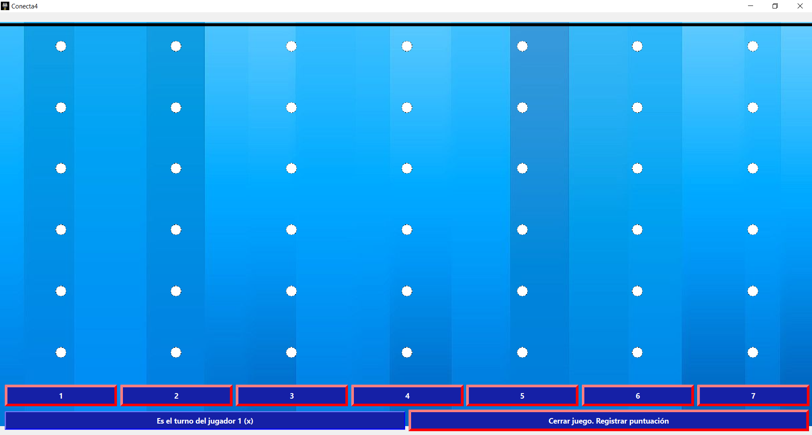
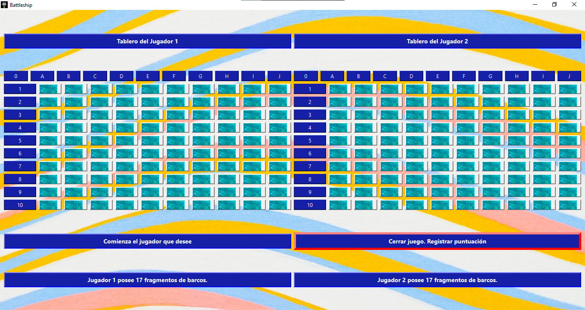
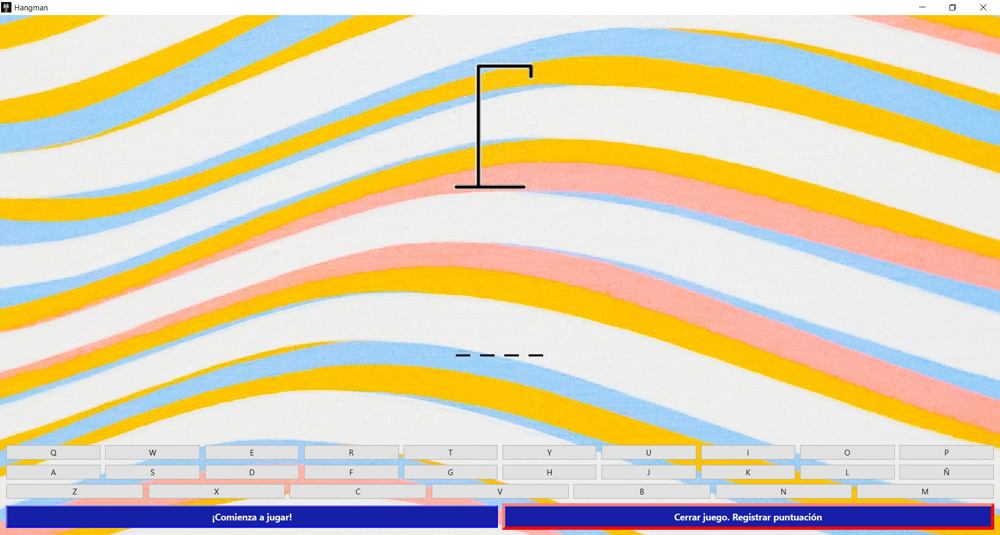

  

# SimpleGames

SimpleGames se tratará de realizar un programa que permita jugar varios juegos simples, con el propósito de pasar un buen rato en tus tiempos libres, se puede jugar algunos juegos sólo y otros con amigos, además de poder empezar a jugar rápido, sin interrupciones ni pantallas de carga y con un menú sencillo, accesible y directo. También almacena los datos importantes de cada juego para que no queden en el olvido y poder superar los récords de tus partidas anteriores. Se realizará mediante el editor de código Visual Code Studios y realizado en lenguaje de programación Python usando el framework de Qt.

## Juegos y Normas

### BlackJack
BlackJack o el juego del 21, consiste en una partida entre dos jugadores, en este caso será el jugador contra la máquina, ya que al ser un programa no multijugador, sino local, no tiene sentido este juego para dos jugadores, ya que el juego requiere de que no se conozca la mano del rival, y al ser una pantalla para dos jugadores, el juego perdería el sentido, así que el juego será contra la inteligencia artificial (IA). Cabe destacar que en principio se ha optado de forma provisional a usar la baraja de cartas española, pero no es una decisión definitiva. Las normas del juego es que una partida (en este caso, de dos jugadores, jugador contra máquina), gana el primero que logre alcanzar de valor total 21 al sumar todos los números de las cartas de la mano, un jugador solo ve sus propias cartas, y deberá de decidir si robar otra por su decisión propia, ya que si sobrepasa el 21 en principio perdería la partida, ya que aunque no alcances 21, ganarías si tu valor total está más cerca que el valor total del rival (en caso de que ambos no superen 21), si un jugador se encuentra por debajo de 21 y el otro lo ha sobrepasado, gana el que se ha quedado corto para llegar a 21, en caso de que ambos jugadores sobrepasen el 21, ganaría el que se haya quedado más cerca del 21.

Para jugar debes de robar una carta clickeando el montón de cartas del medio y pulsar el botón de "Pasar turno" cuando quieras dejar de robar.

### Conecta4
El juego está hecho para jugar contra un amigo localmente, se ha decidido no realizarlo contra la inteligencia artificial, ya que hacer que la inteligencia artificial haga movimientos con sentido sería demasiado complejo, así que se ha centrado que este juego se realizará contra un amigo. Las normas del juego es que un jugador necesita hacer que sus fichas hagan una columna o fila o diagonal de 4, el primero que lo logre gana, pero no puede colocar su ficha en la fila o columna que desea, sino la ficha se introducirá en la última fila disponible de la columna que el jugador elija.

Para jugar debes de clickear el número de la columna donde quieras colocar la pieza.

### BattleShip
Hundir la flota se ha establecido que se jugará jugador contra otro jugador, aquí sería sencillo realizar que pueda jugar contra la IA, pero se ha decidido que sea un juego para dos jugadores. Las normas del juego es que el primero que consiga destruir los 17 fragmentos de barcos ubicado en un mapa no visible, el cual se tendrá que elegir columna y fila donde se querrá “disparar”, si es barco, vuelve a disparar, sino pasa de turno al siguiente jugador, habrá 1 barco de 3 fragmento horizontal, otro vertical, dos fragmentos verticales y horizontales, y 3 barcos de un solo fragmento. Haciendo un total de 17 fragmentos.

Se debe pulsar donde se desee probar suerte para hundir un fragmento de barco

### Hangman
El jugador tendrá que conseguir averiguar todas las letras de la palabra secreta que es establecida al azar de un diccionario de palabras distintas. Las normas del ahorcado es que un jugador escribe la palabra que tratará de adivinar el otro jugador, tendrá que pulsar de letra en letra para ir revelando si dicha letra se encuentra en la palabra o no, se perderá cuando el muñeco se complete, cada fallo procederá a que se vaya completando, y ganará cuando complete la palabra tras revelar todas sus letras.

## Documentación
[Pulse aquí para descargar la documentación](https://github.com/danielmera2912/SimpleGames/releases/download/documentation/Documentacion.de.SimpleGames.pdf)

## Manuales

[Manual de Uso de SimpleGames, pulsa para instalar.](https://github.com/danielmera2912/SimpleGames/releases/download/manual2/Manual.de.uso.de.SimpleGames.pdf)

[Manual de Instalación de SimpleGames, pulsa para instalar.](https://github.com/danielmera2912/SimpleGames/releases/download/manual/Manual.de.Instalacion.de.SimpleGames.pdf)

## Visualización del juego

### Menús

Menú Principal.

Segunda ventana del menú principal.

Asistente para rellenar los datos a la base de datos.

Visualización de las estadísticas.

### Juegos

#### BlackJack

Visualización de una partida comenzada en BlackJack.

Visualización tras robar una carta.

Visualización de una victoria.

Visualización de una derrota.

#### Conecta4

Visualización de una partida de Conecta4 recién comenzada..

Visualización tras rellenar el tablero completo.

#### BattleShip

Visualización del comienzo de una partida de BattleShip..

Visualización de una partida acabada en BattleShip.

#### Hangman

Visualización de una partida comenzada en Hangman.

Visualización de una partida terminada en victoria de Hangman.

Visualización de una partida terminada en derrota de Hangman.

### Ayuda

Visualización de la ventana de ayuda.

## Descarga

[Pulsa aquí para descargar SimpleGames](https://github.com/danielmera2912/SimpleGames/releases/download/game/SimpleGames.exe)
